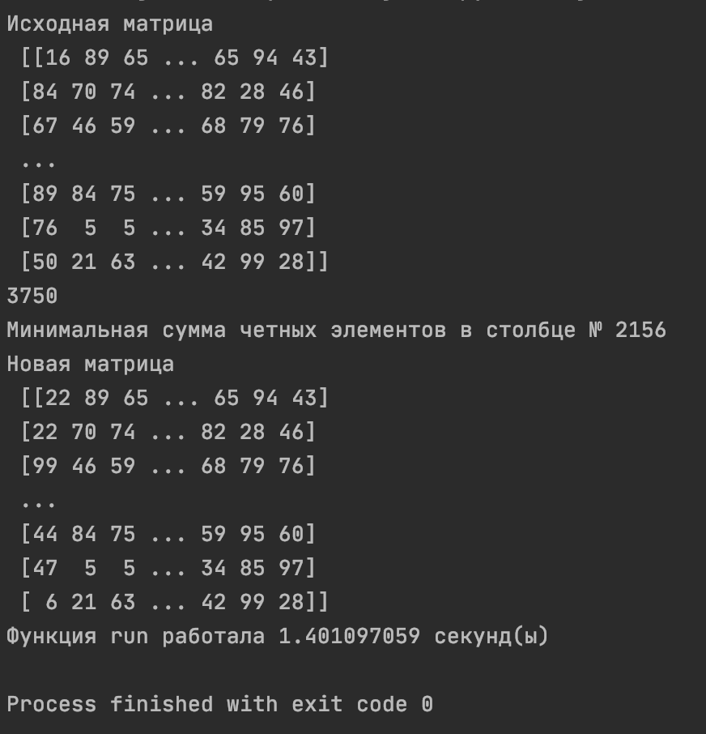
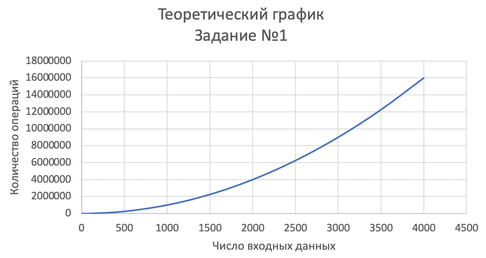
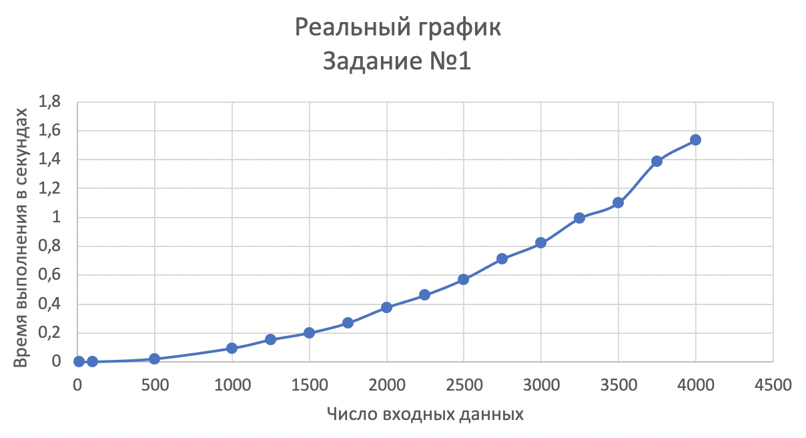
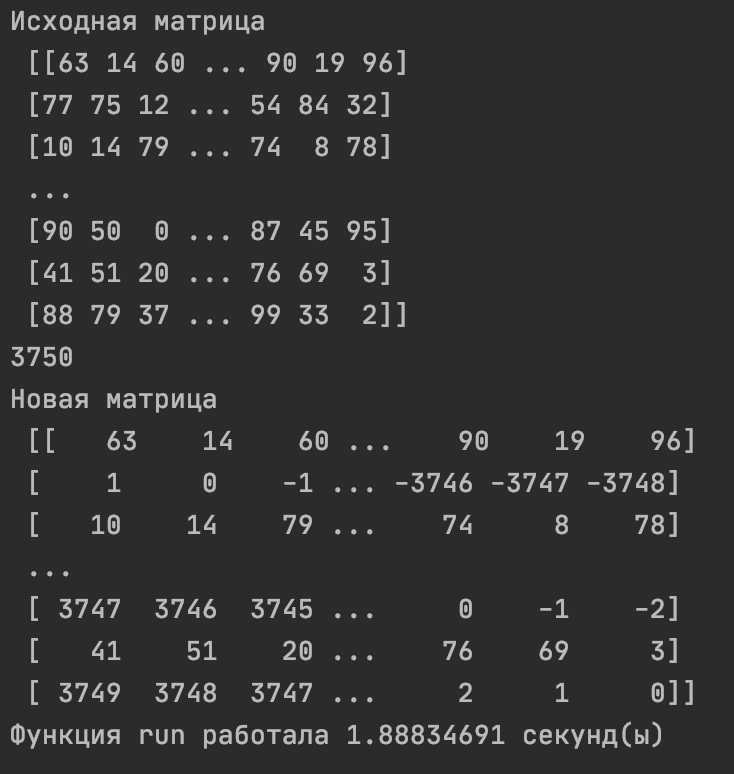
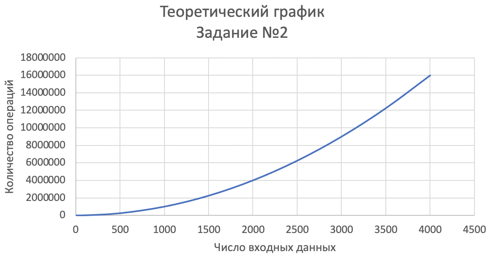
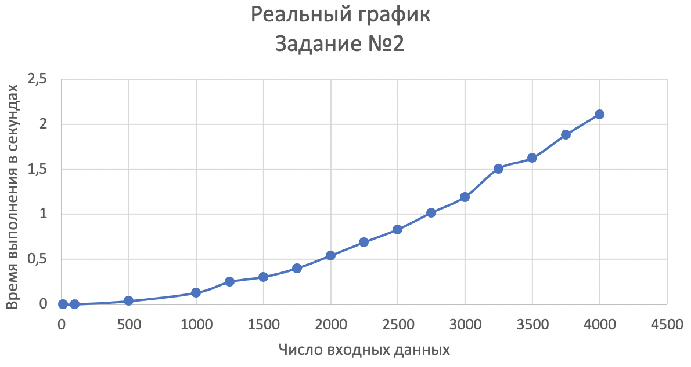
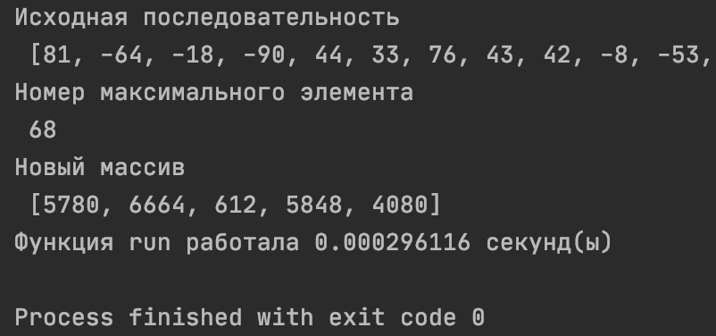
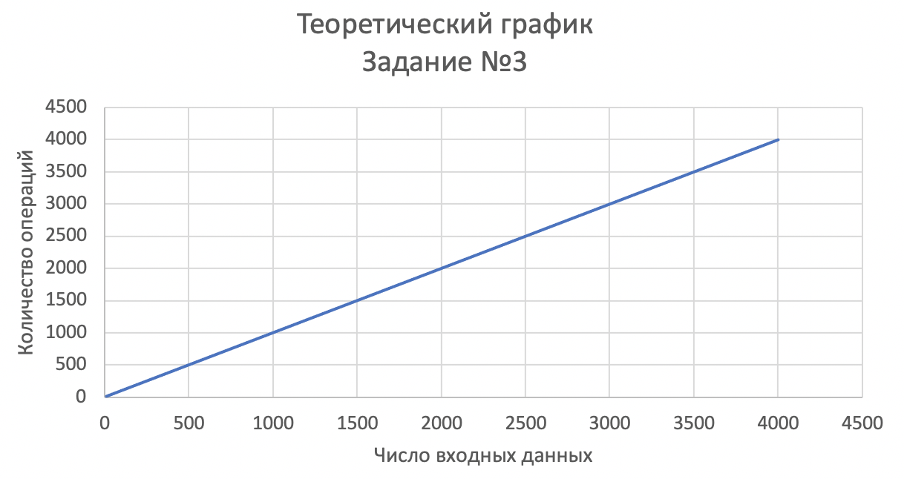
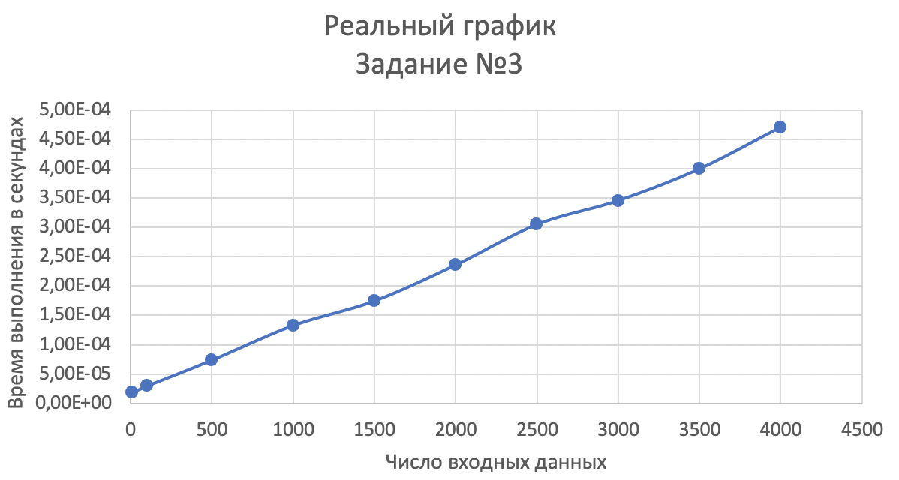

# Лабараторная работа №1
### Задания
1.	Столбцы целочисленной матрицы M[4,4] содержат как четные, 
так и не четные элементы. Поменять местами 1-й столбец со столбцом, 
в котором будет минимальная сумма чётных элементов. 
2.	Значения элементов нечётных строк матрицы M[m,n] 
заменить на разность номеров строки и столбца.
3.	Составить новый массив, состоящий из пяти последних положительных 
элементов последовательности Y1,Y2,...Yn помноженных на номер 
максимального элемента данной последовательности 

### Ход работы
#### Задание №1:
#### Псевдокод:
column_even_elements пустой список для четных элементов столбца 
array[m,n] заполняется случайными целыми числами от 0 до 100 
для i в диапазоне от 0 до n 
	even_rows пустой список для индексов четных строк 
	если i%2 == 0: 
		то для j в array[i]: 
			помещаем j в even_rows 
		even_rows помещаем в column_even_elements  

column_sums = суммируем элементы в каждой строке column_even_elements 
list_array = массив column_sums в список 
index_min_column = индекс минимального значения list_array 

array_0 = первый столбец array 
array_i столбец массива с минимальной суммой четных эл-тов 
меням местами array_0 и array_i 

Полином: O(n2)<br/

**Код в файле: task_1.py**

#### Результат:
Для m = 3750; n = 3750;

**Графики:**
  

####Вывод: 
Реальный график совпадает с теоретическим. Это доказывает, что в данном задании зависимость между количеством исходных данных и временем выполнения квадратичная. 

#### Задание №2:
#### Псевдокод:
array[m,n] заполняется случайными целыми числами от 0 до 100 
для i в диапазоне от 0 до n 
	если i%2 не равно 0 
		то для j в диапазоне от 0 до n 
array[i][j] = i-j 

Полином: O(n2)

**Код в файле: task_2.py**

#### Результат:
Для m = 3750; n = m;

**Графики:**
  

####Вывод: 
Реальный график совпадает с теоретическим. Это доказывает, что в данном задании зависимость между количеством исходных 
данных и временем выполнения квадратичная. 
#### Задание №3:
#### Псевдокод:
Псевдокод:
array последовательность n чисел в диапазоне от -100 до 100 
positive_elements=[] пустой список для индексов положительных элементов 
для i в array[::-1] располагаем последовательность задом наперед 
	если i > 0 и  количество эл-тов в positive_elements < 5: 
		добавляем i в positive_elements 
max = 0 
для i от 0 до n: 
	если array[i] > max: 
		то max = array[i] 
		max_index = i 

new_array = [i*max_index для i в positive_elements] 

Полином: 2n = O(n)

**Код в файле: task_3.py**

#### Результат:

**Графики:**
  

####Вывод:
Реальный график совпадает с теоретическим. Это доказывает, что в данном задании зависимость между количеством исходных 
данных и временем выполнения линейная. 