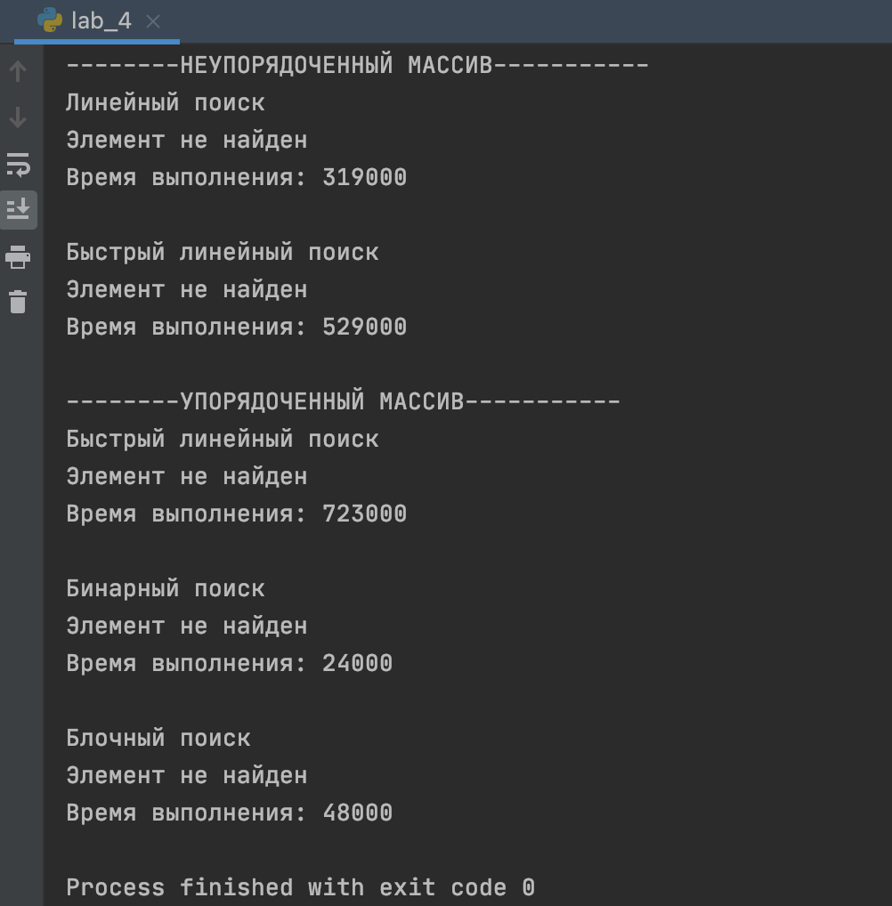

# Лабараторная работа №4
### Задания
**Изучить алгоритмы поиска:**
1) в неупорядоченном массиве: 
    а) линейный; 
    б) быстрый линейный; 

2) в упорядоченном массиве: 
    а) быстрый линейный;  
    б) бинарный; 
    в) блочный. 

###  Результаты:
**Пример результата работы программы**

###Графики зависимостей:
**Масимальное количество операций сравнения**

**Среднее количество операций сравнения**

**Время выполнения алгоритмов в наносекундах**
